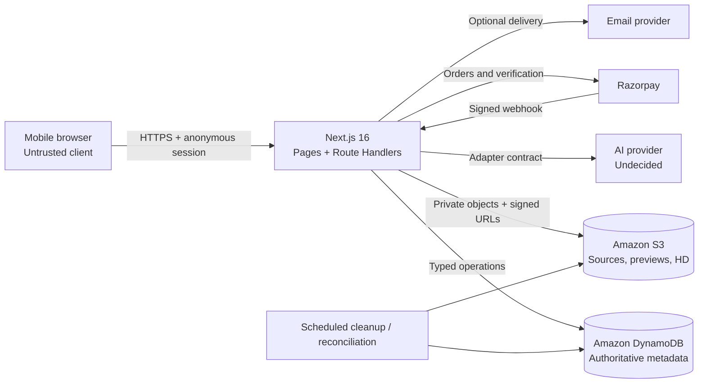
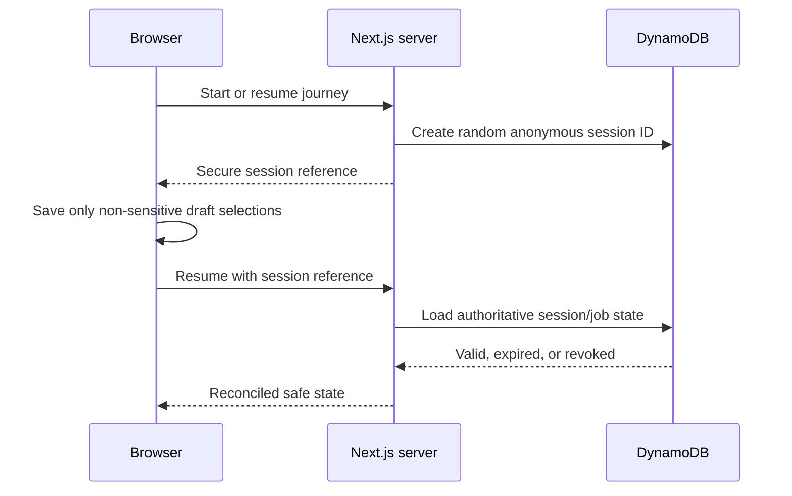
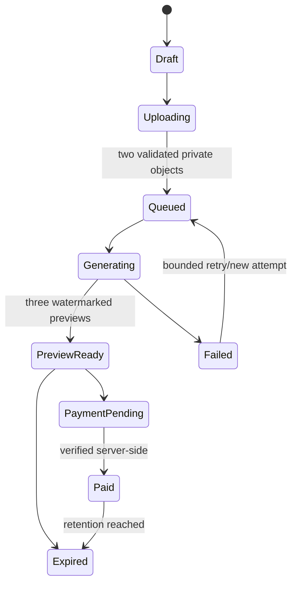
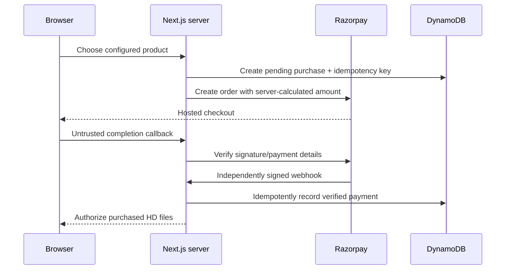
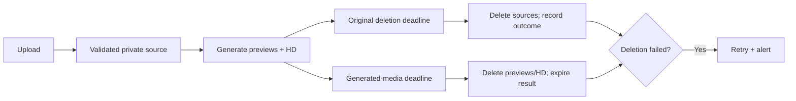

# Architecture

## High-level system

The browser handles presentation and limited non-sensitive draft state. Next.js Route Handlers form the sole application API boundary and coordinate persistence, storage authorization, generation, payment verification, and delivery. DynamoDB is authoritative for server state; private S3 storage is authoritative for bytes.

## Trust boundaries

1. **Browser boundary:** device storage, route parameters, filenames, MIME types, callbacks, and client status are untrusted. Never send server secrets or storage keys to client components.
2. **Application boundary:** Route Handlers authenticate anonymous capabilities, validate inputs, authorize object access, apply rate limits, and enforce state transitions.
3. **Data boundary:** database and storage credentials use least privilege. Object keys are opaque, storage is private, and signed access is short lived.
4. **External provider boundary:** Razorpay, AI, and email responses/webhooks are verified, normalized, retried cautiously, and never treated as authoritative without local reconciliation.

## Anonymous session lifecycle

The server generates identifiers using a cryptographically secure source. A session cookie should be `HttpOnly`, `Secure`, `SameSite=Lax`, scoped narrowly, and rotated when appropriate. Browser storage may cache relationship/occasion/template IDs and current step; it must never hold image blobs, signed URLs, secrets, or proof of payment. Once a job exists, the random recovery token is a separate bearer capability. Store a one-way token digest when feasible and return generic responses for invalid/expired tokens.

## Generation job lifecycle

Each logical job has an opaque ID, a separate result token, status, two source-object references, selections, timestamps, and retention deadlines. Provider attempts have their own idempotency key and provider reference so a retry cannot create an ambiguous purchase. `ImageGenerationProvider` translates provider-specific submission and status into stable application types. A deterministic mock uses the same interface locally.

## Payment lifecycle

The server calculates the amount from central configuration, never from a client-submitted amount. Browser success is not payment proof. Both callback and webhook paths converge on an idempotent transition keyed by provider order/payment IDs. Delayed and out-of-order webhooks are reconciled. Signed HD URLs are issued only after local verified-paid state and authorization for the requested portrait selection.

## Data-retention lifecycle

Objects carry explicit deletion deadlines in database metadata. A scheduled, idempotent cleanup worker queries overdue records, deletes private objects, records only necessary audit metadata, and retries with alerting. The initial configuration assumes originals are kept no more than 24 hours; final generated-media, payment-record, and optional-email periods remain open decisions. Backups and provider-side copies must be included in the final retention policy.

## Provider adapter pattern

Domain orchestration depends on `ImageGenerationProvider`, not a provider SDK. An implementation accepts normalized storage references and curated selections, returns normalized preview metadata, maps provider states/errors, and owns provider-specific polling/webhook behavior. Provider selection occurs only in server composition. Contract tests are reused for the mock and every real adapter.

## Failure, retry, and recovery

- Upload authorization is short lived; repeated completion calls are idempotent and validate both source objects.
- Generation distinguishes logical jobs from attempts. Retry only transient failures with capped exponential backoff and jitter; permanent content/validation errors return to an editable step.
- Page refresh polls or subscribes using authoritative job state; it does not submit a second generation.
- Payment order creation and event handling use idempotency keys, unique provider IDs, transactional state changes, and periodic reconciliation.
- Signed URL expiration triggers reauthorization, not regeneration. Missing objects produce generic responses and an internal alert.
- Cleanup is safe to repeat and treats “already absent” as success. Dead-lettered failures are visible to operations.
- External outages degrade to clear pending/retry states without exposing provider details or losing the recovery URL.

# Secure upload lifecycle

The upload page normalises a selected image and locally detects exactly one face. Only a random JPEG is then sent through a server-created, short-lived authorization to private raw storage. Finalisation checks the HttpOnly anonymous session, ownership, relationship, role, magic bytes, dimensions, pixel/frame limits and the supplied normalized face crop. Sharp re-encodes a static sRGB JPEG without source metadata, stores it under a new random private key, and deletes raw data.

The browser persists only asset ID, role, accepted validation state and dimensions. Preview URLs are short-lived and fetched again after refresh. AWS metadata lives in a service-only DynamoDB table; offline tests/development use an in-memory provider. EventBridge invokes an hourly Lambda to enforce the one-hour raw and 24-hour sanitized retention deadlines, with DynamoDB TTL and S3 lifecycle rules as backstops.
